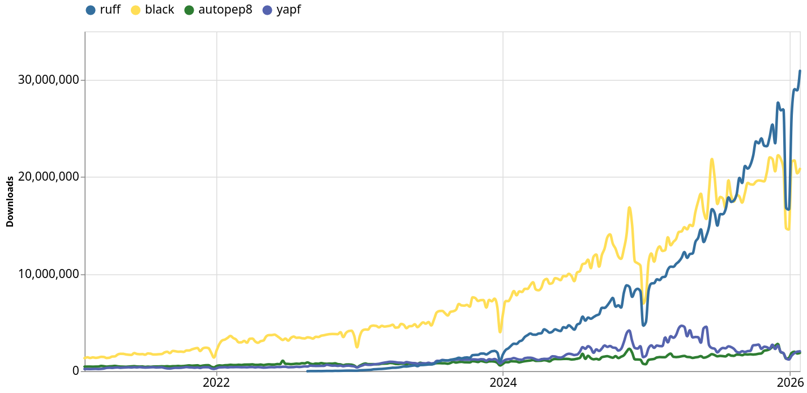
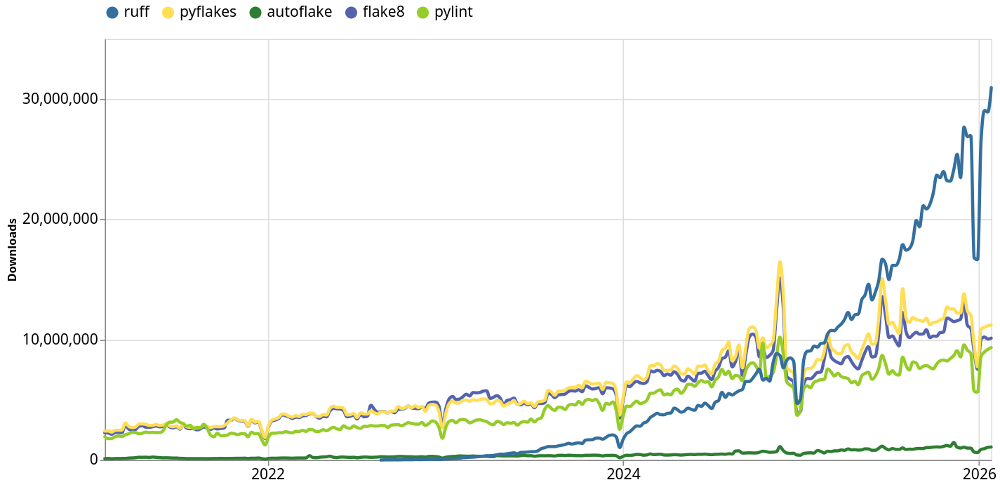

# Part 2: Formatting & Linting

--

#### Formatting

In general: Format your code so that it's more readable!

But formatting code manually suuuuuuuuuucks 😫

--

Solution use a formatter like `black`

Or even better ✨ `ruff` ✨

--



--

#### Linting

> Process of doing static anylisis to find issues in your code

--

Tools that exist are

- pylint
- flake8
- autoflake
- pyflakes
- ruff <- 👀

--

Speed comparison ⚡
![[ruff-vs-other-linters.mp4]]

TODO

--

Error message outputs

E.g. unused import

```python
import os
import pandas

df = pd.DataFrame(data={'col1': [1, 2], 'col2': [3, 4]})
df
```

```sh
example.py:1:1: F401 [*] `os` imported but unused
  |
1 | import os
  | ^^^^^^^^^ F401
Found 1 error.
[*] 1 fixable with `ruff check --fix`.
```

--

**Exercise 2.1**

- use `ruff` to fix a linting error

--

Configurable via `pyproject.toml`

```toml
[tool.ruff.lint]
select = ["E", "F", "W"] # Select specific linting categories
ignore = ["E501", "W503"] # Ignore some specific linting rules
```

--

- [ ] TODO: Example

--

Popularity



--

Use it! Now!

--

There's also a vscode extension

https://marketplace.visualstudio.com/items?itemName=charliermarsh.ruff

<iframe src="https://marketplace.visualstudio.com/items?itemName=charliermarsh.ruff"></iframe>

--

In a nutshell, ruff is

- fast
- modern
- popular
- configurable
- and gives nice error outputs
